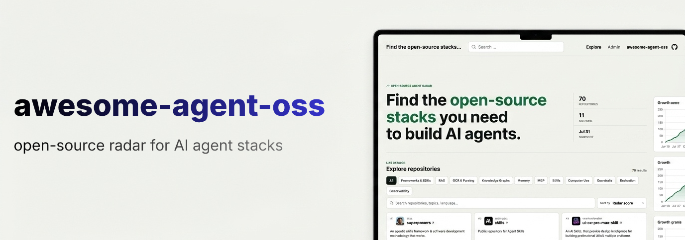

  

<h1 align="center">awesome-agent-oss</h1>

  Discover curated open-source tools for building AI agents and track how they grow over time.

 

<!-- AWESOME_AGENT_OSS:START -->
_🚀 Last updated from snapshot: `2026-07-31 00:00 UTC`._

## [RAG](./sections/rag.md)

Retrieval-augmented generation frameworks and tools

| Rank | Repository | Stars | Forks | Updated | Latest release | License |
| ---: | --- | ---: | ---: | --- | --- | --- |
| 1 | [Graphify-Labs/graphify](https://github.com/Graphify-Labs/graphify) | 99,171 | 9,621 | 2026-07-30 | v0.9.31 (2026-07-30) | Apache-2.0 |
| 2 | [infiniflow/ragflow](https://github.com/infiniflow/ragflow) | 86,456 | 10,148 | 2026-07-31 | v0.26.4 (2026-07-07) | Apache-2.0 |
| 3 | [run-llama/llama_index](https://github.com/run-llama/llama_index) | 51,247 | 7,841 | 2026-07-30 | v0.14.23 (2026-06-24) | MIT |
| 4 | [HKUDS/LightRAG](https://github.com/HKUDS/LightRAG) | 38,365 | 5,396 | 2026-07-30 | v1.5.5rc1 (2026-07-13) | MIT |
| 5 | [QuivrHQ/quivr](https://github.com/QuivrHQ/quivr) | 39,372 | 3,726 | 2025-07-09 | core-0.0.33 (2025-02-04) | Other |
| 6 | [microsoft/graphrag](https://github.com/microsoft/graphrag) | 35,097 | 3,693 | 2026-07-26 | v3.1.1 (2026-07-18) | MIT |
| 7 | [VectifyAI/PageIndex](https://github.com/VectifyAI/PageIndex) | 34,923 | 3,061 | 2026-07-30 | v0.3.0.dev3 (2026-07-10) | MIT |
| 8 | [deepset-ai/haystack](https://github.com/deepset-ai/haystack) | 26,070 | 2,966 | 2026-07-30 | v3.0.0 (2026-07-20) | Apache-2.0 |
| 9 | [Tencent/WeKnora](https://github.com/Tencent/WeKnora) | 19,175 | 2,712 | 2026-07-30 | v0.7.1 (2026-07-24) | Other |
| 10 | [StarTrail-org/PixelRAG](https://github.com/StarTrail-org/PixelRAG) | 8,391 | 710 | 2026-07-30 | v0.4.0 (2026-07-16) | Apache-2.0 |

## [OCR](./sections/ocr.md)

OCR, document parsing, layout analysis, and table extraction

| Rank | Repository | Stars | Forks | Updated | Latest release | License |
| ---: | --- | ---: | ---: | --- | --- | --- |
| 1 | [PaddlePaddle/PaddleOCR](https://github.com/PaddlePaddle/PaddleOCR) | 86,600 | 11,108 | 2026-07-22 | v3.7.0 (2026-06-11) | Apache-2.0 |
| 2 | [tesseract-ocr/tesseract](https://github.com/tesseract-ocr/tesseract) | 75,645 | 10,711 | 2026-07-29 | 5.5.3 (2026-07-24) | Apache-2.0 |
| 3 | [docling-project/docling](https://github.com/docling-project/docling) | 64,018 | 4,545 | 2026-07-30 | v2.117.0 (2026-07-30) | MIT |
| 4 | [hiroi-sora/Umi-OCR](https://github.com/hiroi-sora/Umi-OCR) | 46,325 | 4,546 | 2025-11-20 | v2.1.5 (2025-03-25) | MIT |
| 5 | [naptha/tesseract.js](https://github.com/naptha/tesseract.js) | 38,582 | 2,376 | 2026-05-17 | v7.0.0 (2025-12-15) | Apache-2.0 |
| 6 | [deepseek-ai/DeepSeek-OCR](https://github.com/deepseek-ai/DeepSeek-OCR) | 23,703 | 2,186 | 2026-01-27 | - | MIT |
| 7 | [datalab-to/surya](https://github.com/datalab-to/surya) | 21,183 | 1,522 | 2026-07-23 | v0.22.1 (2026-07-20) | Apache-2.0 |
| 8 | [allenai/olmocr](https://github.com/allenai/olmocr) | 19,238 | 1,591 | 2026-03-25 | v0.4.27 (2026-03-12) | Apache-2.0 |
| 9 | [datalab-to/chandra](https://github.com/datalab-to/chandra) | 11,851 | 1,218 | 2026-06-26 | v0.2.0 (2026-03-18) | Apache-2.0 |
| 10 | [Ucas-HaoranWei/GOT-OCR2.0](https://github.com/Ucas-HaoranWei/GOT-OCR2.0) | 8,214 | 714 | 2025-02-10 | - | - |

## [Memory](./sections/memory.md)

Long-term, short-term memory systems for AI agents

| Rank | Repository | Stars | Forks | Updated | Latest release | License |
| ---: | --- | ---: | ---: | --- | --- | --- |
| 1 | [mem0ai/mem0](https://github.com/mem0ai/mem0) | 62,156 | 7,243 | 2026-07-30 | n8n-nodes-mem0-v0.1.1 (2026-07-30) | Apache-2.0 |
| 2 | [MemPalace/mempalace](https://github.com/MemPalace/mempalace) | 57,897 | 7,449 | 2026-07-31 | v3.6.0 (2026-07-17) | MIT |
| 3 | [topoteretes/cognee](https://github.com/topoteretes/cognee) | 29,608 | 2,852 | 2026-07-30 | v1.4.0.dev3 (2026-07-30) | Apache-2.0 |
| 4 | [supermemoryai/supermemory](https://github.com/supermemoryai/supermemory) | 28,700 | 2,498 | 2026-07-31 | server-v0.0.6 (2026-07-19) | MIT |
| 5 | [volcengine/OpenViking](https://github.com/volcengine/OpenViking) | 27,667 | 2,173 | 2026-07-31 | v0.4.11 (2026-07-23) | AGPL-3.0 |
| 6 | [rohitg00/agentmemory](https://github.com/rohitg00/agentmemory) | 26,100 | 2,187 | 2026-07-29 | v0.9.28 (2026-07-19) | Apache-2.0 |
| 7 | [MemoriLabs/Memori](https://github.com/MemoriLabs/Memori) | 15,670 | 2,885 | 2026-07-28 | v3.3.6 (2026-05-28) | Other |
| 8 | [vectorize-io/hindsight](https://github.com/vectorize-io/hindsight) | 18,945 | 1,199 | 2026-07-30 | v0.8.6 (2026-07-29) | MIT |
| 9 | [memvid/memvid](https://github.com/memvid/memvid) | 16,084 | 1,395 | 2026-07-14 | v2.0.140 (2026-05-27) | Apache-2.0 |
| 10 | [EverMind-AI/EverOS](https://github.com/EverMind-AI/EverOS) | 11,695 | 872 | 2026-07-30 | v1.2.1 (2026-07-29) | Apache-2.0 |

## [Skills](./sections/skills.md)

Skills for AI agents

| Rank | Repository | Stars | Forks | Updated | Latest release | License |
| ---: | --- | ---: | ---: | --- | --- | --- |
| 1 | [obra/superpowers](https://github.com/obra/superpowers) | 263,991 | 23,568 | 2026-07-28 | v6.2.0 (2026-07-24) | MIT |
| 2 | [anthropics/skills](https://github.com/anthropics/skills) | 165,283 | 19,650 | 2026-07-24 | - | - |
| 3 | [nextlevelbuilder/ui-ux-pro-max-skill](https://github.com/nextlevelbuilder/ui-ux-pro-max-skill) | 111,880 | 11,938 | 2026-07-28 | v2.11.3 (2026-07-28) | MIT |
| 4 | [addyosmani/agent-skills](https://github.com/addyosmani/agent-skills) | 81,030 | 8,741 | 2026-07-26 | 0.6.5 (2026-07-26) | MIT |
| 5 | [ComposioHQ/awesome-claude-skills](https://github.com/ComposioHQ/awesome-claude-skills) | 71,392 | 8,026 | 2026-07-24 | - | - |
| 6 | [Leonxlnx/taste-skill](https://github.com/Leonxlnx/taste-skill) | 69,405 | 4,794 | 2026-07-23 | - | MIT |
| 7 | [VoltAgent/awesome-openclaw-skills](https://github.com/VoltAgent/awesome-openclaw-skills) | 51,625 | 4,978 | 2026-07-16 | - | MIT |
| 8 | [kepano/obsidian-skills](https://github.com/kepano/obsidian-skills) | 43,721 | 3,120 | 2026-06-08 | - | MIT |
| 9 | [K-Dense-AI/scientific-agent-skills](https://github.com/K-Dense-AI/scientific-agent-skills) | 32,207 | 3,192 | 2026-07-29 | v2.61.0 (2026-07-29) | MIT |
| 10 | [blader/humanizer](https://github.com/blader/humanizer) | 32,227 | 2,934 | 2026-07-22 | v2.9.1 (2026-07-22) | MIT |

## [Observability](./sections/observability.md)

Observability and evaluation tools for AI agents

| Rank | Repository | Stars | Forks | Updated | Latest release | License |
| ---: | --- | ---: | ---: | --- | --- | --- |
| 1 | [langfuse/langfuse](https://github.com/langfuse/langfuse) | 32,189 | 3,451 | 2026-07-30 | v4.1.0 (2026-07-30) | Other |
| 2 | [Arize-ai/phoenix](https://github.com/Arize-ai/phoenix) | 10,822 | 1,020 | 2026-07-31 | arize-phoenix-v19.11.0 (2026-07-30) | Other |
| 3 | [open-telemetry/opentelemetry-collector](https://github.com/open-telemetry/opentelemetry-collector) | 7,315 | 2,176 | 2026-07-30 | v0.157.0 (2026-07-21) | Apache-2.0 |
| 4 | [langwatch/langwatch](https://github.com/langwatch/langwatch) | 3,437 | 338 | 2026-07-31 | langwatch-3.7.0 (2026-07-26) | Apache-2.0 |
| 5 | [openlit/openlit](https://github.com/openlit/openlit) | 2,659 | 342 | 2026-07-29 | openlit-1.24.2 (2026-07-28) | Apache-2.0 |
<!-- AWESOME_AGENT_OSS:END -->
