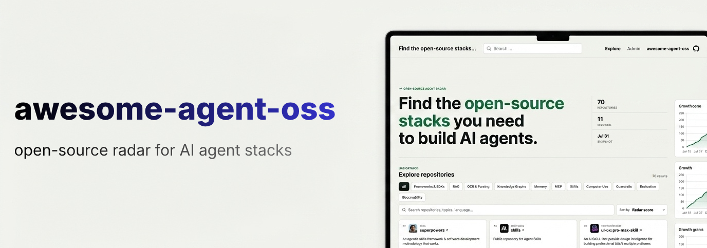

  

<h1 align="center">awesome-agent-oss</h1>

  Discover curated open-source tools for building AI agents and track how they grow over time.

  
  

  <a href="https://awesomeagent.vercel.app">
    <strong>Explore at Website &rarr;</strong>
  </a>

  <a href="#how-rankings-work">How Rankings Work</a>
  &nbsp;·&nbsp;
  <a href="https://github.com/skan0779/awesome-agent-oss/issues/new?template=repository-suggestion.yml">Suggest a Repository</a>

---

## How Rankings Work

- Repositories are discovered through GitHub topics and manually reviewed before publication.
- Stars, forks, releases, and repository activity are collected daily from the GitHub API.
- Radar Score combines overall adoption with star-growth signals across 1, 3, 7, 30, and 60 days.
- Newer repositories are ranked with lower confidence until enough daily history is available.

 

---

<!-- AWESOME_AGENT_OSS:START -->
_🚀 Last updated from snapshot: `2026-10-09 06:06 UTC`._

## [Trending This Week](https://awesomeagent.vercel.app/#trending)

| Rank | Repository | Stars 1d | Stars 7d | Total Stars |
| ---: | --- | ---: | ---: | ---: |
| 1 | [DietrichGebert/ponytail](https://github.com/DietrichGebert/ponytail) | +979 | +8,009 | 158,781 |
| 2 | [Panniantong/Agent-Reach](https://github.com/Panniantong/Agent-Reach) | +785 | +6,761 | 94,327 |
| 3 | [affaan-m/ECC](https://github.com/affaan-m/ECC) | +456 | +4,724 | 275,513 |
| 4 | [tt-a1i/archify](https://github.com/tt-a1i/archify) | +1,026 | +4,493 | 80,432 |
| 5 | [ifixai-ai/iFixAi](https://github.com/ifixai-ai/iFixAi) | +345 | +4,105 | 22,761 |
| 6 | [cathrynlavery/diagram-design](https://github.com/cathrynlavery/diagram-design) | +1,528 | +3,734 | 46,768 |
| 7 | [thedotmack/claude-mem](https://github.com/thedotmack/claude-mem) | +778 | +3,519 | 98,671 |
| 8 | [addyosmani/agent-skills](https://github.com/addyosmani/agent-skills) | +496 | +3,090 | 103,471 |
| 9 | [vectorize-io/hindsight](https://github.com/vectorize-io/hindsight) | +456 | +3,011 | 47,405 |
| 10 | [obra/superpowers](https://github.com/obra/superpowers) | +178 | +2,575 | 296,643 |

 

## [Frameworks & SDKs](./sections/frameworks.md)

Frameworks and SDKs for building, orchestrating, and running AI agents.

| Rank | Repository | Stars | Forks | Updated | Latest release | License |
| ---: | --- | ---: | ---: | --- | --- | --- |
| 1 | [headroomlabs-ai/headroom](https://github.com/headroomlabs-ai/headroom) | 74,780 | 5,797 | 2026-10-09 | v0.40.0 (2026-10-06) | Apache-2.0 |
| 2 | [ruvnet/ruflo](https://github.com/ruvnet/ruflo) | 74,156 | 8,812 | 2026-10-09 | v3.56.1 (2026-10-09) | MIT |
| 3 | [langchain-ai/langgraph](https://github.com/langchain-ai/langgraph) | 42,927 | 7,295 | 2026-10-08 | cli==0.4.33 (2026-10-07) | MIT |
| 4 | [Tracer-Cloud/opensre](https://github.com/Tracer-Cloud/opensre) | 11,666 | 1,707 | 2026-10-09 | v0.1.2026.10.9 (2026-10-09) | Apache-2.0 |
| 5 | [bytedance/deer-flow](https://github.com/bytedance/deer-flow) | 83,553 | 11,608 | 2026-10-09 | v2.1.0 (2026-09-24) | MIT |
| 6 | [aaif-goose/goose](https://github.com/aaif-goose/goose) | 55,094 | 6,390 | 2026-10-09 | v1.54.0 (2026-10-08) | Apache-2.0 |
| 7 | [crewAIInc/crewAI](https://github.com/crewAIInc/crewAI) | 59,479 | 8,664 | 2026-10-08 | 1.15.26 (2026-10-08) | MIT |
| 8 | [CopilotKit/CopilotKit](https://github.com/CopilotKit/CopilotKit) | 37,854 | 4,716 | 2026-10-09 | v1.77.2 (2026-10-08) | MIT |
| 9 | [langchain-ai/deepagents](https://github.com/langchain-ai/deepagents) | 30,048 | 4,213 | 2026-10-09 | deepagents==0.7.23 (2026-10-07) | MIT |
| 10 | [strands-agents/harness-sdk](https://github.com/strands-agents/harness-sdk) | 8,746 | 1,344 | 2026-10-08 | harness-cli/v0.2.0 (2026-10-08) | Apache-2.0 |

## [Platforms & Apps](./sections/platforms-apps.md)

Self-hosted platforms and applications for building, deploying, and operating AI agents.

| Rank | Repository | Stars | Forks | Updated | Latest release | License |
| ---: | --- | ---: | ---: | --- | --- | --- |
| 1 | [farion1231/cc-switch](https://github.com/farion1231/cc-switch) | 141,589 | 9,472 | 2026-10-09 | v4.0.5 (2026-10-08) | MIT |
| 2 | [666ghj/MiroFish](https://github.com/666ghj/MiroFish) | 77,242 | 11,803 | 2026-10-01 | v0.1.2 (2026-03-07) | AGPL-3.0 |
| 3 | [Untrivial-ai/agent-orchestrator](https://github.com/OrchestratorInc/agent-orchestrator) | 12,960 | 1,779 | 2026-10-09 | v0.13.5 (2026-10-08) | Apache-2.0 |
| 4 | [HKUDS/DeepTutor](https://github.com/HKUDS/DeepTutor) | 40,967 | 5,172 | 2026-10-08 | v1.6.14 (2026-10-08) | Apache-2.0 |
| 5 | [danny-avila/LibreChat](https://github.com/LibreChat-AI/LibreChat) | 45,425 | 9,324 | 2026-10-09 | - | MIT |
| 6 | [bytedance/deer-flow](https://github.com/bytedance/deer-flow) | 83,553 | 11,608 | 2026-10-09 | v2.1.0 (2026-09-24) | MIT |
| 7 | [omnigent-ai/omnigent](https://github.com/omnigent-ai/omnigent) | 10,690 | 1,722 | 2026-10-09 | v0.17.0 (2026-10-06) | Apache-2.0 |
| 8 | [ItzCrazyKns/Vane](https://github.com/ItzCrazyKns/Vane) | 37,168 | 4,126 | 2026-09-01 | v1.12.2 (2026-04-10) | MIT |
| 9 | [trycompai/crm](https://github.com/trycompai/crm) | 11,162 | 1,594 | 2026-09-11 | v1.15.3 (2026-08-21) | MIT |
| 10 | [Mintplex-Labs/anything-llm](https://github.com/Mintplex-Labs/anything-llm) | 66,846 | 7,461 | 2026-10-09 | v1.17.0 (2026-10-01) | MIT |

## [AI Gateways](./sections/ai-gateways.md)

Gateways for routing, securing, observing, and managing access to AI model providers.

| Rank | Repository | Stars | Forks | Updated | Latest release | License |
| ---: | --- | ---: | ---: | --- | --- | --- |
| 1 | [maximhq/bifrost](https://github.com/maximhq/bifrost) | 8,658 | 1,357 | 2026-10-09 | ent-v2.2.6-base (2026-10-06) | Apache-2.0 |
| 2 | [Portkey-AI/gateway](https://github.com/Portkey-AI/gateway) | 13,153 | 1,337 | 2026-05-25 | v1.15.2 (2026-01-12) | MIT |
| 3 | [IBM/mcp-context-forge](https://github.com/IBM/mcp-context-forge) | 4,590 | 910 | 2026-10-09 | v1.0.11 (2026-09-28) | Apache-2.0 |
| 4 | [Kong/kong](https://github.com/Kong/kong) | 44,255 | 5,227 | 2026-10-08 | 3.9.3 (2026-06-17) | Apache-2.0 |
| 5 | [archestra-ai/archestra](https://github.com/archestra-ai/archestra) | 4,359 | 1,212 | 2026-10-09 | platform-v1.3.71 (2026-10-08) | Other |
| 6 | [mnfst/manifest](https://github.com/mnfst/llm-gateway) | 7,567 | 516 | 2026-10-07 | manifest@6.28.5 (2026-10-07) | MIT |
| 7 | [algorithmicsuperintelligence/optillm](https://github.com/algorithmicsuperintelligence/optillm) | 4,309 | 392 | 2026-09-28 | v0.4.0 (2026-09-28) | Apache-2.0 |

## [RAG](./sections/rag.md)

Retrieval, indexing, and generation tools for grounding AI applications in external knowledge.

| Rank | Repository | Stars | Forks | Updated | Latest release | License |
| ---: | --- | ---: | ---: | --- | --- | --- |
| 1 | [Tencent/WeKnora](https://github.com/Tencent/WeKnora) | 32,715 | 4,356 | 2026-10-09 | v0.8.2 (2026-09-24) | Other |
| 2 | [VectifyAI/PageIndex](https://github.com/VectifyAI/PageIndex) | 39,009 | 3,381 | 2026-10-08 | v0.2.22 (2026-10-08) | MIT |
| 3 | [infiniflow/ragflow](https://github.com/infiniflow/ragflow) | 91,881 | 10,923 | 2026-10-09 | v1.0.0-rc1 (2026-09-29) | Apache-2.0 |
| 4 | [HKUDS/LightRAG](https://github.com/HKUDS/LightRAG) | 40,025 | 5,671 | 2026-10-08 | v1.5.7 (2026-09-02) | MIT |
| 5 | [StarTrail-org/PixelRAG](https://github.com/StarTrail-org/PixelRAG) | 10,224 | 890 | 2026-10-08 | v0.4.0 (2026-07-16) | Apache-2.0 |
| 6 | [microsoft/graphrag](https://github.com/microsoft/graphrag) | 36,271 | 3,837 | 2026-10-08 | v3.3.0 (2026-10-08) | MIT |
| 7 | [run-llama/llama_index](https://github.com/run-llama/llama_index) | 52,448 | 8,306 | 2026-10-08 | v0.14.25 (2026-09-21) | MIT |
| 8 | [nageoffer/ragent](https://github.com/nageoffer/ragent) | 4,215 | 848 | 2026-10-07 | 1.1.0 (2026-08-11) | Apache-2.0 |
| 9 | [deepset-ai/haystack](https://github.com/deepset-ai/haystack) | 26,699 | 3,260 | 2026-10-09 | v3.3.0 (2026-10-01) | Apache-2.0 |
| 10 | [stanford-oval/storm](https://github.com/stanford-oval/storm) | 31,597 | 2,979 | 2025-09-30 | v1.1.0 (2025-01-23) | MIT |

## [OCR & Parsing](./sections/ocr.md)

OCR, document extraction, layout analysis, and structured document conversion.

| Rank | Repository | Stars | Forks | Updated | Latest release | License |
| ---: | --- | ---: | ---: | --- | --- | --- |
| 1 | [microsoft/markitdown](https://github.com/microsoft/markitdown) | 189,114 | 14,038 | 2026-10-04 | v0.1.8 (2026-09-21) | MIT |
| 2 | [opendatalab/MinerU](https://github.com/opendatalab/MinerU) | 81,318 | 6,766 | 2026-10-09 | mineru-4.0.11-released (2026-10-08) | Other |
| 3 | [docling-project/docling](https://github.com/docling-project/docling) | 68,573 | 5,027 | 2026-10-09 | v2.135.0 (2026-10-07) | MIT |
| 4 | [firecrawl/anydoc](https://github.com/firecrawl/anydoc) | 22,638 | 1,435 | 2026-08-28 | v0.2.4 (2026-08-27) | MIT |
| 5 | [PaddlePaddle/PaddleOCR](https://github.com/PaddlePaddle/PaddleOCR) | 90,819 | 11,459 | 2026-09-16 | v3.7.0 (2026-06-11) | Apache-2.0 |
| 6 | [hiroi-sora/Umi-OCR](https://github.com/hiroi-sora/Umi-OCR) | 47,702 | 4,660 | 2025-11-20 | v2.1.5 (2025-03-25) | MIT |
| 7 | [firecrawl/pdf-inspector](https://github.com/firecrawl/pdf-inspector) | 19,551 | 1,325 | 2026-10-07 | v1.25.2 (2026-09-28) | MIT |
| 8 | [datalab-to/chandra](https://github.com/datalab-to/chandra) | 12,475 | 1,253 | 2026-06-26 | v0.2.0 (2026-03-18) | Apache-2.0 |
| 9 | [tesseract-ocr/tesseract](https://github.com/tesseract-ocr/tesseract) | 76,879 | 10,823 | 2026-10-09 | 5.5.3 (2026-07-24) | Apache-2.0 |
| 10 | [chrisryugj/kordoc](https://github.com/chrisryugj/kordoc) | 2,373 | 438 | 2026-10-09 | v4.21.4 (2026-10-09) | MIT |

## [Knowledge Graphs](./sections/knowledge-graph.md)

Knowledge graph, graph database, and graph retrieval tools for AI applications.

| Rank | Repository | Stars | Forks | Updated | Latest release | License |
| ---: | --- | ---: | ---: | --- | --- | --- |
| 1 | [Graphify-Labs/graphify](https://github.com/Graphify-Labs/graphify) | 124,803 | 12,051 | 2026-10-09 | v0.9.82 (2026-10-09) | Apache-2.0 |
| 2 | [Egonex-AI/Understand-Anything](https://github.com/Egonex-AI/Understand-Anything) | 85,698 | 7,204 | 2026-10-09 | v2.9.0 (2026-07-10) | MIT |
| 3 | [FalkorDB/FalkorDB](https://github.com/FalkorDB/FalkorDB) | 8,298 | 530 | 2026-10-08 | v6.0.2 (2026-10-08) | Other |
| 4 | [semantica-agi/semantica](https://github.com/semantica-agi/semantica) | 13,836 | 1,584 | 2026-10-09 | v0.7.0 (2026-09-22) | MIT |
| 5 | [getzep/graphiti](https://github.com/getzep/graphiti) | 31,580 | 3,243 | 2026-10-09 | v0.30.2 (2026-09-08) | Apache-2.0 |
| 6 | [open-metadata/OpenMetadata](https://github.com/open-metadata/OpenMetadata) | 15,421 | 2,437 | 2026-10-09 | 2.0.4-release (2026-10-06) | Apache-2.0 |
| 7 | [microsoft/graphrag](https://github.com/microsoft/graphrag) | 36,271 | 3,837 | 2026-10-08 | v3.3.0 (2026-10-08) | MIT |
| 8 | [surrealdb/surrealdb](https://github.com/surrealdb/surrealdb) | 33,116 | 1,368 | 2026-10-08 | v3.3.0 (2026-09-28) | Other |
| 9 | [ArcadeData/arcadedb](https://github.com/ArcadeData/arcadedb) | 1,191 | 151 | 2026-10-09 | 26.10.1 (2026-10-05) | Apache-2.0 |
| 10 | [HelixDB/helix-db](https://github.com/HelixDB/helix-db) | 6,120 | 376 | 2026-10-08 | v3.5.1 (2026-10-08) | Apache-2.0 |

## [Memory](./sections/memory.md)

Short-term, long-term, and persistent memory systems for AI agents.

| Rank | Repository | Stars | Forks | Updated | Latest release | License |
| ---: | --- | ---: | ---: | --- | --- | --- |
| 1 | [vectorize-io/hindsight](https://github.com/vectorize-io/hindsight) | 47,405 | 5,973 | 2026-10-08 | v0.10.3 (2026-10-08) | MIT |
| 2 | [thedotmack/claude-mem](https://github.com/thedotmack/claude-mem) | 98,671 | 8,651 | 2026-10-09 | v13.35.0 (2026-10-09) | Apache-2.0 |
| 3 | [DeusData/codebase-memory-mcp](https://github.com/DeusData/codebase-memory-mcp) | 46,181 | 3,798 | 2026-10-09 | v0.11.0 (2026-09-15) | MIT |
| 4 | [volcengine/OpenViking](https://github.com/volcengine/OpenViking) | 39,458 | 3,113 | 2026-10-09 | v0.4.23 (2026-10-02) | AGPL-3.0 |
| 5 | [mem0ai/mem0](https://github.com/mem0ai/mem0) | 66,864 | 7,872 | 2026-10-09 | ts-v3.3.1 (2026-09-25) | Apache-2.0 |
| 6 | [topoteretes/cognee](https://github.com/topoteretes/cognee) | 31,801 | 3,280 | 2026-10-09 | v1.6.3 (2026-10-07) | Apache-2.0 |
| 7 | [semantica-agi/semantica](https://github.com/semantica-agi/semantica) | 13,836 | 1,584 | 2026-10-09 | v0.7.0 (2026-09-22) | MIT |
| 8 | [TencentCloud/TencentDB-Agent-Memory](https://github.com/TencentCloud/TencentDB-Agent-Memory) | 27,839 | 2,701 | 2026-09-29 | v2.0.1 (2026-08-25) | Other |
| 9 | [getzep/graphiti](https://github.com/getzep/graphiti) | 31,580 | 3,243 | 2026-10-09 | v0.30.2 (2026-09-08) | Apache-2.0 |
| 10 | [rohitg00/agentmemory](https://github.com/rohitg00/agentmemory) | 29,252 | 2,557 | 2026-10-09 | v0.9.30 (2026-10-06) | Apache-2.0 |

## [MCP](./sections/mcp.md)

Model Context Protocol servers, clients, SDKs, registries, and tool integrations.

| Rank | Repository | Stars | Forks | Updated | Latest release | License |
| ---: | --- | ---: | ---: | --- | --- | --- |
| 1 | [DeusData/codebase-memory-mcp](https://github.com/DeusData/codebase-memory-mcp) | 46,181 | 3,798 | 2026-10-09 | v0.11.0 (2026-09-15) | MIT |
| 2 | [bethington/ghidra-mcp](https://github.com/bethington/ghidra-mcp) | 4,985 | 239 | 2026-10-09 | v6.0.0 (2026-07-25) | Apache-2.0 |
| 3 | [ChromeDevTools/chrome-devtools-mcp](https://github.com/ChromeDevTools/chrome-devtools-mcp) | 53,150 | 5,876 | 2026-10-09 | chrome-devtools-mcp-v1.10.1 (2026-09-23) | Apache-2.0 |
| 4 | [0x4m4/hexstrike-ai](https://github.com/0x4m4/hexstrike-ai) | 12,545 | 2,549 | 2026-08-03 | - | MIT |
| 5 | [upstash/context7](https://github.com/upstash/context7) | 62,820 | 3,058 | 2026-10-08 | ctx7@0.5.15 (2026-10-08) | MIT |
| 6 | [punkpeye/awesome-mcp-servers](https://github.com/punkpeye/awesome-mcp-servers) | 95,947 | 17,297 | 2026-10-09 | - | MIT |
| 7 | [oraios/serena](https://github.com/oraios/serena) | 30,112 | 2,049 | 2026-10-08 | v1.7.0 (2026-08-09) | Other |
| 8 | [CoplayDev/unity-mcp](https://github.com/CoplayDev/unity-mcp) | 14,779 | 1,537 | 2026-10-08 | v10.3.0 (2026-10-04) | MIT |
| 9 | [mrexodia/ida-pro-mcp](https://github.com/mrexodia/ida-pro-mcp) | 12,557 | 1,486 | 2026-09-26 | 1.4.0 (2025-10-06) | MIT |
| 10 | [github/github-mcp-server](https://github.com/github/github-mcp-server) | 33,459 | 5,111 | 2026-10-08 | v2.0.2 (2026-10-08) | MIT |

## [Skills](./sections/skills.md)

Reusable skills, instructions, and workflow packages for AI agents.

| Rank | Repository | Stars | Forks | Updated | Latest release | License |
| ---: | --- | ---: | ---: | --- | --- | --- |
| 1 | [DietrichGebert/ponytail](https://github.com/DietrichGebert/ponytail) | 158,781 | 8,537 | 2026-10-08 | v5.1.0 (2026-10-08) | MIT |
| 2 | [tt-a1i/archify](https://github.com/tt-a1i/archify) | 80,432 | 5,406 | 2026-10-09 | v3.0.1 (2026-09-28) | MIT |
| 3 | [cathrynlavery/diagram-design](https://github.com/cathrynlavery/diagram-design) | 46,768 | 2,974 | 2026-10-08 | - | MIT |
| 4 | [affaan-m/ECC](https://github.com/affaan-m/ECC) | 275,513 | 41,124 | 2026-10-05 | v2.2.3 (2026-10-01) | MIT |
| 5 | [addyosmani/agent-skills](https://github.com/addyosmani/agent-skills) | 103,471 | 10,830 | 2026-10-03 | 0.6.12 (2026-10-03) | MIT |
| 6 | [Leonxlnx/taste-skill](https://github.com/Leonxlnx/taste-skill) | 93,889 | 6,377 | 2026-10-08 | - | MIT |
| 7 | [blader/humanizer](https://github.com/blader/humanizer) | 54,998 | 4,351 | 2026-09-28 | v3.1.0 (2026-09-28) | MIT |
| 8 | [obra/superpowers](https://github.com/obra/superpowers) | 296,643 | 26,494 | 2026-10-09 | v6.4.2 (2026-09-25) | MIT |
| 9 | [nextlevelbuilder/ui-ux-pro-max-skill](https://github.com/nextlevelbuilder/ui-ux-pro-max-skill) | 133,979 | 14,237 | 2026-10-09 | v2.15.0 (2026-08-13) | MIT |
| 10 | [D4Vinci/Scrapling](https://github.com/D4Vinci/Scrapling) | 86,418 | 8,859 | 2026-10-08 | v0.4.15 (2026-08-23) | BSD-3-Clause |

## [Coding Agents](./sections/coding-agents.md)

Agents and development tools for writing, reviewing, debugging, and maintaining software.

| Rank | Repository | Stars | Forks | Updated | Latest release | License |
| ---: | --- | ---: | ---: | --- | --- | --- |
| 1 | [alibaba/open-code-review](https://github.com/alibaba/open-code-review) | 44,683 | 3,232 | 2026-10-08 | v1.12.13 (2026-10-08) | Apache-2.0 |
| 2 | [ruvnet/ruflo](https://github.com/ruvnet/ruflo) | 74,156 | 8,812 | 2026-10-09 | v3.56.1 (2026-10-09) | MIT |
| 3 | [Untrivial-ai/agent-orchestrator](https://github.com/OrchestratorInc/agent-orchestrator) | 12,960 | 1,779 | 2026-10-09 | v0.13.5 (2026-10-08) | Apache-2.0 |
| 4 | [omnigent-ai/omnigent](https://github.com/omnigent-ai/omnigent) | 10,690 | 1,722 | 2026-10-09 | v0.17.0 (2026-10-06) | Apache-2.0 |
| 5 | [backnotprop/plannotator](https://github.com/backnotprop/plannotator) | 9,236 | 698 | 2026-10-09 | v0.28.8 (2026-10-07) | Apache-2.0 |
| 6 | [kirodotdev/KiroCrew](https://github.com/kirodotdev/KiroCrew) | 4,334 | 767 | 2026-10-09 | v0.7.2 (2026-09-29) | Apache-2.0 |
| 7 | [google-gemini/gemini-cli](https://github.com/google-gemini/gemini-cli) | 107,265 | 14,705 | 2026-10-08 | v0.63.0 (2026-10-06) | Apache-2.0 |
| 8 | [getsentry/XcodeBuildMCP](https://github.com/getsentry/MobileBuildMCP) | 6,470 | 322 | 2026-10-09 | v2.7.1 (2026-09-23) | MIT |
| 9 | [MinishLab/semble](https://github.com/MinishLab/semble) | 6,192 | 274 | 2026-10-08 | v0.6.2 (2026-10-05) | MIT |
| 10 | [potpie-ai/potpie](https://github.com/potpie-ai/potpie) | 5,739 | 685 | 2026-10-08 | v2.0.1 (2026-08-31) | Apache-2.0 |

## [Sandboxes](./sections/sandboxes.md)

Isolated runtimes and execution environments for safely running agent-generated code and tools.

| Rank | Repository | Stars | Forks | Updated | Latest release | License |
| ---: | --- | ---: | ---: | --- | --- | --- |
| 1 | [nolabs-ai/nono](https://github.com/nolabs-ai/nono) | 4,405 | 298 | 2026-10-05 | v0.79.0 (2026-09-30) | Apache-2.0 |
| 2 | [microsoft/Orchard](https://github.com/microsoft/Orchard-Agentic) | 546 | 43 | 2026-10-09 | - | MIT |

## [Computer Use](./sections/computer-use.md)

Browser, desktop, and GUI automation for agents that operate software.

| Rank | Repository | Stars | Forks | Updated | Latest release | License |
| ---: | --- | ---: | ---: | --- | --- | --- |
| 1 | [Panniantong/Agent-Reach](https://github.com/Panniantong/Agent-Reach) | 94,327 | 8,245 | 2026-10-08 | v1.5.0 (2026-06-11) | MIT |
| 2 | [trycua/cua](https://github.com/trycua/cua) | 29,087 | 2,055 | 2026-10-09 | cua-sdk-v0.4.1 (2026-10-05) | MIT |
| 3 | [citrolabs/ego-lite](https://github.com/citrolabs/ego-lite) | 16,990 | 904 | 2026-10-08 | v2.0.0 (2026-09-10) | MIT |
| 4 | [microsoft/playwright](https://github.com/microsoft/playwright) | 97,331 | 6,565 | 2026-10-09 | v1.64.0 (2026-10-07) | Apache-2.0 |
| 5 | [browser-use/browser-use](https://github.com/browser-use/browser-use) | 117,336 | 12,987 | 2026-10-07 | 0.13.11 (2026-10-07) | MIT |
| 6 | [jackwener/OpenCLI](https://github.com/jackwener/OpenCLI) | 29,951 | 2,922 | 2026-09-24 | v1.8.8 (2026-08-30) | Apache-2.0 |
| 7 | [browser-use/browser-harness](https://github.com/browser-use/browser-harness) | 18,362 | 1,794 | 2026-10-09 | v0.1.13 (2026-09-04) | MIT |
| 8 | [nanobrowser/nanobrowser](https://github.com/nanobrowser/nanobrowser) | 14,016 | 1,482 | 2026-10-02 | v0.2.0 (2026-10-02) | Apache-2.0 |
| 9 | [browserbase/stagehand](https://github.com/browserbase/stagehand) | 25,584 | 1,753 | 2026-10-09 | @browserbasehq/stagehand@3.7.3 (2026-08-28) | MIT |
| 10 | [simular-ai/Agent-S](https://github.com/simular-ai/Agent-S) | 12,566 | 1,467 | 2026-10-08 | v0.3.2 (2025-12-16) | Apache-2.0 |

## [Voice & Realtime](./sections/voice-realtime.md)

Speech, voice, and real-time multimodal systems for conversational AI agents.

| Rank | Repository | Stars | Forks | Updated | Latest release | License |
| ---: | --- | ---: | ---: | --- | --- | --- |
| 1 | [jamiepine/voicebox](https://github.com/jamiepine/voicebox) | 56,693 | 7,068 | 2026-10-07 | v0.5.0 (2026-04-25) | MIT |
| 2 | [pipecat-ai/pipecat](https://github.com/pipecat-ai/pipecat) | 16,285 | 2,844 | 2026-10-09 | v1.12.0 (2026-09-26) | BSD-2-Clause |
| 3 | [livekit/agents](https://github.com/livekit/agents) | 14,655 | 3,890 | 2026-10-09 | livekit-agents@1.8.5 (2026-10-06) | Apache-2.0 |
| 4 | [microsoft/VibeVoice](https://github.com/microsoft/VibeVoice) | 54,694 | 6,141 | 2026-10-08 | - | MIT |
| 5 | [kyutai-labs/pocket-tts](https://github.com/kyutai-labs/pocket-tts) | 9,837 | 1,036 | 2026-10-07 | v3.3.0 (2026-09-24) | MIT |
| 6 | [modelscope/FunASR](https://github.com/modelscope/FunASR) | 20,615 | 2,064 | 2026-10-08 | v1.4.16 (2026-09-18) | MIT |
| 7 | [huggingface/speech-to-speech](https://github.com/huggingface/speech-to-speech) | 13,400 | 1,700 | 2026-10-08 | v1.0.0 (2026-09-06) | Apache-2.0 |
| 8 | [TEN-framework/ten-framework](https://github.com/TEN-framework/ten-framework) | 11,153 | 1,365 | 2026-10-08 | 0.11.73 (2026-09-22) | Other |
| 9 | [supertone-inc/supertonic](https://github.com/supertone-oss-archive/supertonic) | 13,774 | 1,550 | 2026-09-09 | v2.0.0 (2026-01-06) | MIT |

## [Guardrails](./sections/guardrails.md)

Safety, validation, privacy, and security controls for LLM and agent applications.

| Rank | Repository | Stars | Forks | Updated | Latest release | License |
| ---: | --- | ---: | ---: | --- | --- | --- |
| 1 | [ifixai-ai/iFixAi](https://github.com/ifixai-ai/iFixAi) | 22,761 | 1,427 | 2026-10-09 | v4.1.0 (2026-10-08) | Apache-2.0 |
| 2 | [usestrix/strix](https://github.com/usestrix/strix) | 67,370 | 7,404 | 2026-10-08 | v1.7.0 (2026-10-05) | Apache-2.0 |
| 3 | [NVIDIA/SkillSpector](https://github.com/NVIDIA/SkillSpector) | 19,733 | 1,724 | 2026-10-08 | v2.12.0 (2026-09-23) | Apache-2.0 |
| 4 | [0x4m4/hexstrike-ai](https://github.com/0x4m4/hexstrike-ai) | 12,545 | 2,549 | 2026-08-03 | - | MIT |
| 5 | [KeygraphHQ/shannon](https://github.com/KeygraphHQ/shannon) | 48,688 | 5,577 | 2026-10-08 | v3.4.0 (2026-10-06) | AGPL-3.0 |
| 6 | [Tencent/AI-Infra-Guard](https://github.com/Tencent/AI-Infra-Guard) | 6,796 | 642 | 2026-10-09 | v4.6.5 (2026-10-08) | Apache-2.0 |
| 7 | [openai/codex-security](https://github.com/openai/codex-security) | 11,042 | 858 | 2026-10-09 | npm-v0.2.0 (2026-10-06) | Apache-2.0 |
| 8 | [nolabs-ai/nono](https://github.com/nolabs-ai/nono) | 4,405 | 298 | 2026-10-05 | v0.79.0 (2026-09-30) | Apache-2.0 |
| 9 | [NVIDIA/garak](https://github.com/NVIDIA/garak) | 9,504 | 1,350 | 2026-10-08 | v0.17.0 (2026-09-09) | Apache-2.0 |
| 10 | [microsoft/agent-governance-toolkit](https://github.com/microsoft/agent-governance-toolkit) | 6,415 | 1,126 | 2026-10-09 | v4.1.0 (2026-06-09) | MIT |

## [Evaluation](./sections/evaluation.md)

Evaluation, benchmarking, testing, and scoring for LLM and agent systems.

| Rank | Repository | Stars | Forks | Updated | Latest release | License |
| ---: | --- | ---: | ---: | --- | --- | --- |
| 1 | [ifixai-ai/iFixAi](https://github.com/ifixai-ai/iFixAi) | 22,761 | 1,427 | 2026-10-09 | v4.1.0 (2026-10-08) | Apache-2.0 |
| 2 | [promptfoo/promptfoo](https://github.com/promptfoo/promptfoo) | 25,829 | 2,452 | 2026-10-09 | code-scan-action-0.2.2 (2026-10-08) | MIT |
| 3 | [confident-ai/deepeval](https://github.com/confident-ai/deepeval) | 18,710 | 2,033 | 2026-10-07 | python-v4.2.4 (2026-09-22) | Apache-2.0 |
| 4 | [comet-ml/opik](https://github.com/comet-ml/opik) | 22,465 | 1,847 | 2026-10-09 | 2.2.95 (2026-10-08) | Apache-2.0 |
| 5 | [mlflow/mlflow](https://github.com/mlflow/mlflow) | 28,318 | 6,435 | 2026-10-09 | v3.17.0 (2026-10-07) | Apache-2.0 |
| 6 | [vibrantlabsai/ragas](https://github.com/vibrantlabsai/ragas) | 15,969 | 1,749 | 2026-02-24 | v0.4.3 (2026-01-13) | Apache-2.0 |
| 7 | [UKGovernmentBEIS/inspect_ai](https://github.com/UKGovernmentBEIS/inspect_ai) | 2,963 | 792 | 2026-10-09 | - | MIT |
| 8 | [MatrAIx-ai/MatrAIx-Persona-8B](https://github.com/MatrAIx-ai/MatrAIx-Persona-8B) | 2,026 | 340 | 2026-09-18 | - | MIT |
| 9 | [Giskard-AI/giskard-oss](https://github.com/Giskard-AI/giskard-oss) | 5,879 | 549 | 2026-10-09 | giskard-checks/v1.0.6 (2026-10-09) | Apache-2.0 |
| 10 | [latitude-dev/latitude-llm](https://github.com/latitude-dev/latitude-llm) | 4,716 | 400 | 2026-10-08 | typescript-telemetry-4.3.0 (2026-10-08) | MIT |

## [Observability](./sections/observability.md)

Tracing, monitoring, and production analytics for LLM and agent systems.

| Rank | Repository | Stars | Forks | Updated | Latest release | License |
| ---: | --- | ---: | ---: | --- | --- | --- |
| 1 | [Tracer-Cloud/opensre](https://github.com/Tracer-Cloud/opensre) | 11,666 | 1,707 | 2026-10-09 | v0.1.2026.10.9 (2026-10-09) | Apache-2.0 |
| 2 | [langfuse/langfuse](https://github.com/langfuse/langfuse) | 35,551 | 3,953 | 2026-10-09 | v4.55.0 (2026-10-08) | Other |
| 3 | [comet-ml/opik](https://github.com/comet-ml/opik) | 22,465 | 1,847 | 2026-10-09 | 2.2.95 (2026-10-08) | Apache-2.0 |
| 4 | [mlflow/mlflow](https://github.com/mlflow/mlflow) | 28,318 | 6,435 | 2026-10-09 | v3.17.0 (2026-10-07) | Apache-2.0 |
| 5 | [Arize-ai/phoenix](https://github.com/Arize-ai/phoenix) | 11,762 | 1,195 | 2026-10-09 | arize-phoenix-v20.20.0 (2026-10-09) | Other |
| 6 | [getagentseal/codeburn](https://github.com/getagentseal/codeburn) | 11,360 | 877 | 2026-10-08 | mac-v0.9.25 (2026-09-21) | MIT |
| 7 | [langwatch/langwatch](https://github.com/langwatch/langwatch) | 4,925 | 408 | 2026-10-09 | langwatch-3.20.1 (2026-10-02) | Apache-2.0 |
| 8 | [SigNoz/signoz](https://github.com/SigNoz/signoz) | 32,314 | 2,531 | 2026-10-09 | v0.145.0 (2026-10-05) | Other |
| 9 | [builderz-labs/mission-control](https://github.com/builderz-labs/mission-control) | 6,328 | 107 | 2026-09-28 | v2.3.0 (2026-07-25) | MIT |
| 10 | [OneUptime/oneuptime](https://github.com/OneUptime/oneuptime) | 7,714 | 471 | 2026-10-09 | 14.0.24 (2026-10-09) | Other |

## [UI/UX](./sections/ui-ux.md)

User interfaces, clients, and workspaces for interacting with AI and agent systems.

| Rank | Repository | Stars | Forks | Updated | Latest release | License |
| ---: | --- | ---: | ---: | --- | --- | --- |
| 1 | [nextlevelbuilder/ui-ux-pro-max-skill](https://github.com/nextlevelbuilder/ui-ux-pro-max-skill) | 133,979 | 14,237 | 2026-10-09 | v2.15.0 (2026-08-13) | MIT |
| 2 | [nexu-io/open-design](https://github.com/nexu-io/open-design) | 100,091 | 11,547 | 2026-10-09 | open-design-v0.24.1 (2026-09-24) | Apache-2.0 |
| 3 | [JCodesMore/ai-website-cloner-template](https://github.com/JCodesMore/ai-website-cloner-template) | 36,302 | 5,319 | 2026-10-05 | v0.6.1 (2026-10-05) | MIT |
| 4 | [ibelick/ui-skills](https://github.com/ibelick/ui-skills) | 9,526 | 439 | 2026-10-07 | v0.2.3 (2026-06-22) | MIT |
| 5 | [CopilotKit/CopilotKit](https://github.com/CopilotKit/CopilotKit) | 37,854 | 4,716 | 2026-10-09 | v1.77.2 (2026-10-08) | MIT |
| 6 | [open-webui/open-webui](https://github.com/open-webui/open-webui) | 154,077 | 22,547 | 2026-10-08 | v0.11.4 (2026-09-21) | Other |
| 7 | [assistant-ui/assistant-ui](https://github.com/assistant-ui/assistant-ui) | 12,456 | 1,239 | 2026-10-09 | @assistant-ui/react-ag-ui@0.0.65 (2026-10-06) | MIT |
| 8 | [nexu-io/html-anything](https://github.com/nexu-io/html-anything) | 9,043 | 874 | 2026-09-15 | - | Apache-2.0 |
| 9 | [langchain-ai/agent-chat-ui](https://github.com/langchain-ai/agent-chat-ui) | 3,207 | 695 | 2026-10-06 | - | MIT |
| 10 | [Chainlit/chainlit](https://github.com/Chainlit/chainlit) | 12,505 | 1,751 | 2026-09-18 | 2.12.0 (2026-08-25) | Apache-2.0 |
<!-- AWESOME_AGENT_OSS:END -->
